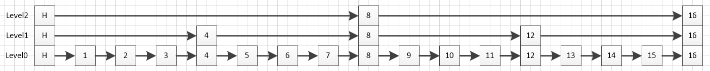
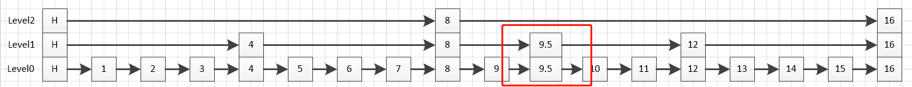
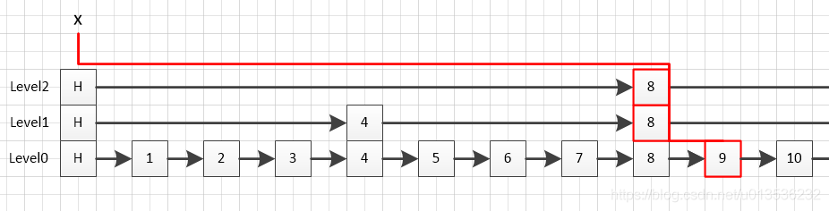

# Redis 跳跃表

Redis的跳跃表是用来实现有序集合(ZSET)的。 


如图所示


图中`skiplist`并不包含真实的数据元素，而是反映了`skiplist`的结构关系，其中`level0,level1,level2`表示层，每层中的元素表示`skiplistNode`的分值`score`。

跳跃表定义

```c
// 跳跃表
/**
 *  Redis的跳跃表用于实现有序集合(ZSET), ZSET集合种每个元素都有一个对应的评分
 *  成员按照评分从低到高存储。在redis跳跃表里，节点也是按分值从低到高排列的，而不是按对象本身的大小。
*/
typedef struct zskiplist {
    // 跳跃表的头节点/尾节点
    struct zskiplistNode *header, *tail;
    // 表中节点数量
    unsigned long length;
    // 表中层数最大的节点的层数
    int level;
} zskiplist;
```

跳跃表节定义
```c
/* ZSETs use a specialized version of Skiplists 
 * 跳跃表节点
*/
typedef struct zskiplistNode {
    // 成员对象 -- 注意这里的变化，低版本为 robj robj
    sds ele;
    // 分值, Redis的跳跃表用于实现有序集合(ZSET), ZSET集合种每个元素都有一个对应的评分
    // 成员按照评分从低到高存储。在redis跳跃表里，节点也是按分值从低到高排列的，而不是按对象本身的大小。
    double score;
    // 后退指针, 因为zset支持分数以从高到低的顺序返回集合元素，这个时候就会用到后退指针。
    struct zskiplistNode *backward;
    // 层
    struct zskiplistLevel {
        // 前进指针, 指节点在这一层对应的下一个节点
        struct zskiplistNode *forward;
        // 跨度,指节点在这一层距离下一个节点的距离，这个变量可以用来快速的确定节点的排名
        unsigned long span;
    } level[];
} zskiplistNode;
```
- score `zskiplist`中每个成员`zskiplistNode`都有一个评分`score`, 每个成员都是按照评分由小到大存储的，而非存储对象的大小。
- backward zset支持以分数从高到低的顺序返回元素集合，此时需要后退指针
- level 是一个结构体数组，用以存储`zskiplist`节点在每一层中的相关信息，包括
- -  forward  是指节点在本层中指向下一个节点的指针。一个节点，在每一层都有不同的forward指针，例如上图中的节点，在level0，节点8的forward就是节点9，在level1，节点8的forward就是节点12，在level2，节点8的forward是16。
- -  span 是指节点本层中距离下一个节点的距离。这个变量可以用来快速的确定节点的排名。例如上图中节点8，在level0，节点8的span就是1，在level1，节点8的span就是4，在level2，节点8的span是8。

跳跃表的创建

```c
/* Create a new skiplist. 
 * 创建一个新碟 skiplist
*/
zskiplist *zslCreate(void) {
    int j;
    zskiplist *zsl;

    zsl = zmalloc(sizeof(*zsl));
    zsl->level = 1;
    zsl->length = 0;
    // 创建头节点, 最大32层，头节点评分为0， 不存储数据 O(1)
    zsl->header = zslCreateNode(ZSKIPLIST_MAXLEVEL,0,NULL);
    // 对于头节点的每一层初始化前进指针和跨度 O(1)
    // ZSKIPLIST_MAXLEVEL，这个是跳跃表的最大层数，源码里通过宏定义设置为了32，也就是说，节点再多，也不会超过32层
    for (j = 0; j < ZSKIPLIST_MAXLEVEL; j++) {
        zsl->header->level[j].forward = NULL;
        zsl->header->level[j].span = 0;
    }
    zsl->header->backward = NULL;
    zsl->tail = NULL;
    return zsl;
}
```
- ZSKIPLIST_MAXLEVEL 跳跃表的最大层数，源码里通过宏定义设置为了32，也就是说，节点再多，也不会超过32层。
- 初始化头节点

跳跃表的插入
```c
/* Insert a new node in the skiplist. Assumes the element does not already
 * exist (up to the caller to enforce that). The skiplist takes ownership
 * of the passed SDS string 'ele'. 
 *  创建一个成员为 ele ，分值为 score 的新节点，并将这个新节点插入到跳跃表 zsl 中。
 *  函数的返回值为新节点
 * 
 *  T_wrost = O(N^2), T_avg = O(N log N)
 * */
zskiplistNode *zslInsert(zskiplist *zsl, double score, sds ele) {
    // 记录查找元素过程中，每层能够到达的最右节点
    zskiplistNode *update[ZSKIPLIST_MAXLEVEL], *x;
    // 记录查找元素过程中，每层所跨越的节点数量
    unsigned long rank[ZSKIPLIST_MAXLEVEL];
    int i, level;

    serverAssert(!isnan(score));
    x = zsl->header;

    // 记录沿途访问的节点 x 到 update[i]，以及跨越的节点数量 span 到 rank[i]
    // T_wrost = O(N^2), T_avg = O(N log N)
    for (i = zsl->level-1; i >= 0; i--) {
        /* store rank that is crossed to reach the insert position */
        // 
        rank[i] = i == (zsl->level-1) ? 0 : rank[i+1];
        
        //  节点当前层存在右节点
        while (x->level[i].forward 
                // 右节点的score 比给定的score小
            && (x->level[i].forward->score < score 
                // 右节点的score 等于给定的score && 右节点存储ele小于给定存储ele
                || (x->level[i].forward->score == score && sdscmp(x->level[i].forward->ele,ele) < 0)))
        {
            //  记录跨越了多少个元素
            rank[i] += x->level[i].span;
            // 继续访问下一个元素
            x = x->level[i].forward;
        }
        // 保存本层访问的元素
        update[i] = x;
    }
    /* we assume the element is not already inside, since we allow duplicated
     * scores, reinserting the same element should never happen since the
     * caller of zslInsert() should test in the hash table if the element is
     * already inside or not. */
    // 因为这个函数不可能处理两个节点 ele 和 score 都相同的情况，
    // 所以直接创建新节点，不用检查存在性
    // 随机获取当前元素所在层， n+1层的概率是n层概率的4倍
    level = zslRandomLevel();
    // 新节点所在层大于跳表当前拥有的最大层，
    // 那么更新 zsl->level 参数
    // 并且初始化 update 和 rank 参数在相应的层的数据
    if (level > zsl->level) {
        for (i = zsl->level; i < level; i++) {
            rank[i] = 0;
            update[i] = zsl->header;
            update[i]->level[i].span = zsl->length;
        }
        zsl->level = level;
    }
    // 创建新节点
    x = zslCreateNode(level,score,ele);
    // 根据 update 和 rank 两个数组的资料，初始化新节点
    // 并设置相应的指针
    for (i = 0; i < level; i++) {
        // 设置前进指针
        x->level[i].forward = update[i]->level[i].forward;
        update[i]->level[i].forward = x;

        // 设置节点跨度 span
        /* update span covered by update[i] as x is inserted here */
        x->level[i].span = update[i]->level[i].span - (rank[0] - rank[i]);
        update[i]->level[i].span = (rank[0] - rank[i]) + 1;
    }

    // 更新沿途访问节点的 span 值
    /* increment span for untouched levels */
    for (i = level; i < zsl->level; i++) {
        update[i]->level[i].span++;
    }

    // 设置后退指针
    x->backward = (update[0] == zsl->header) ? NULL : update[0];
    // 设置前进指针
    if (x->level[0].forward)
        x->level[0].forward->backward = x;
    else
        zsl->tail = x;
    // 更新跳跃表节点数量
    zsl->length++;
    
    return x;
}
```

假设向上图表示的跳表中插入一个分值为9.5的节点，且随机生成的层数为2，插入后的`skiplist`如下图所示：


从逻辑上来讲，大致可以分为2步：
1. 找到新节点在每一层的上一个节点。
2. 将新节点插入到每一层，

最终代码，主要逻辑如下:

按层遍历`skiplist`，记录update和rank
```c
// 记录查找元素过程中，每层能够到达的最右节点
zskiplistNode *update[ZSKIPLIST_MAXLEVEL], *x;
// 记录查找元素过程中，每层所跨越的节点数量
unsigned long rank[ZSKIPLIST_MAXLEVEL];
int i, level;

serverAssert(!isnan(score));
x = zsl->header;

// 记录沿途访问的节点 x 到 update[i]，以及跨越的节点数量 span 到 rank[i]
// T_wrost = O(N^2), T_avg = O(N log N)
for (i = zsl->level-1; i >= 0; i--) {
    /* store rank that is crossed to reach the insert position */
    // 
    rank[i] = i == (zsl->level-1) ? 0 : rank[i+1];
    
    //  节点当前层存在右节点
    while (x->level[i].forward 
            // 右节点的score 比给定的score小
        && (x->level[i].forward->score < score 
            // 右节点的score 等于给定的score && 右节点存储ele小于给定存储ele
            || (x->level[i].forward->score == score && sdscmp(x->level[i].forward->ele,ele) < 0)))
    {
        //  记录跨越了多少个元素
        rank[i] += x->level[i].span;
        // 继续访问下一个元素
        x = x->level[i].forward;
    }
    // 保存本层访问的元素
    update[i] = x;
}
```
这里创建了两个数组，数组大小都是默认的最大层数
- `update`数组用于记录新节点在每一层中的上一个节点
- `rank`节点用于记录节点在当前层的排名，也就是在当前层，`update`节点到头节点的距离，核心是为了用来计算`span`

上述代码可以用下图来简单概述：



通过一次逐层遍历`skiplist`的`level`数组，确定`update`数组和`rank`数组的值。

遍历前定一个`zskiplistNode`指针`x`指向头节点。


当前层遍历过程中，如果`x`的前进指针`forward`指向的节点`score`评分小于新节点，那么新节点应该在`x`前进指针指向节点的右侧。因此，`rank`应当加上`x`节点的`span`（也就是`x`到`x`下一个节点的距离），然后再将`x`指向`x`的下一个节点。
```c
//  节点当前层存在右节点
while (x->level[i].forward 
        // 右节点的score 比给定的score小
    && (x->level[i].forward->score < score 
        // 右节点的score 等于给定的score && 右节点存储ele小于给定存储ele
        || (x->level[i].forward->score == score && sdscmp(x->level[i].forward->ele,ele) < 0)))
{
    //  记录跨越了多少个元素
    rank[i] += x->level[i].span;
    // 继续访问下一个元素
    x = x->level[i].forward;
}
```
在当前层的遍历过程中，退出条件有两个：1）当前层的`x` 没有下一个节点；2)当前层`x`节点的下一个节点的评分大于插入节点的评分。此时，我们就找到了当前层中，新插入节点的上一个节点`x`，并将其更新到`update`数组
```c
// 保存本层访问的元素
update[i] = x;
```

如上图所示，逐层遍历过程中，从`skiplist`的最大层`level2`开始遍历，找到的`update`节点是节点8，对应的`rank`是此时`x`节点的`span`，也就是头节点在`level2`的`span`。`x`也移动到了节点8。 进入下一层遍历时，就不会再重头开始遍历。因为`level2`遍历时，`x`已经移到了`update`节点，而在`level1`，`update`节点一定在`x`当前的位置之后，所以对于`rank`的计算，也可以直接在上一层的`rank`的基础上继续计算，这也就是下述代码的含义：

```c
rank[i] = i == (zsl->level-1) ? 0 : rank[i+1];
```

随机生成新节点待插入的层

```c
level = zslRandomLevel();
```

跳跃表在插入节点时，会随机生成节点的层数，通过控制每一层的概率，控制每一层的节点个数，也就是保证第一层的节点个数，之后逐层增加。`zslRandomLevel`函数的定义，如下代码所示：
```c
int zslRandomLevel(void) {
    static const int threshold = ZSKIPLIST_P*RAND_MAX;
    int level = 1;
    while (random() < threshold)
        level += 1;
    return (level<ZSKIPLIST_MAXLEVEL) ? level : ZSKIPLIST_MAXLEVEL;
}
```
这里面有一个宏定义`ZSKIPLIST_P`，默认为`0.25`，也就是说，生成`n+1`层的概率是生成`n`层概率的`4`倍。

如果随机生成的层`level`大于`skiplist`的当前层`level`。那么从`skiplist`当前拥有层开始到新生层的层`level`，中间这些层的`update`和`rank`节点还未或许到，就需要逐层进行初始化。这部分很简单，因为这些层还没有节点，所以这些层的`update`节点只能是头节点，`rank`也都是`0`（头节点到头节点），而`span`则是节点个数（本身该层的头节点此时还没有forward节点，也不该有span，但插入节点后新节点需要用这个span计算新节点的span，因此这里需要把span设置为当前跳跃表中的节点个数），如下代码所示：

```c
if (level > zsl->level) {
    for (i = zsl->level; i < level; i++) {
        rank[i] = 0;
        update[i] = zsl->header;
        update[i]->level[i].span = zsl->length;
    }
    zsl->level = level;
}
```
注意`span`的计算，`(rank[0] - rank[i])`就是上面说的两段距离之差。

插入新节点

```c
// 创建新节点
x = zslCreateNode(level,score,ele);
// 根据 update 和 rank 两个数组的资料，初始化新节点
// 并设置相应的指针
for (i = 0; i < level; i++) {
    // 设置前进指针
    x->level[i].forward = update[i]->level[i].forward;
    update[i]->level[i].forward = x;

    // 设置节点跨度 span
    /* update span covered by update[i] as x is inserted here */
    x->level[i].span = update[i]->level[i].span - (rank[0] - rank[i]);
    update[i]->level[i].span = (rank[0] - rank[i]) + 1;
}
```

更新新节点插入层以下层的span

如果随机生成的层数小于之前跳跃表中的层数，那么大于随机生成的层数的那些层在创建新节点的过程中就没有被操作到（创建新节点的时候是从0遍历到随机生成的层数），对于这些没有操作到的层，里面的update节点对应的span应当+1（因为后面插入了一个节点）。例如插入9.5节点，如果插入过程中生成的随机层数是2，那么在插入新节点那一段程序中，只会更新level1中节点8的span和level0中节点9的span，而level中节点8的span也是需要+1的，所以需要手动更新一下为涉及到的层。
```c
// 更新沿途访问节点的 span 值
/* increment span for untouched levels */
for (i = level; i < zsl->level; i++) {
    update[i]->level[i].span++;
}
```

设置新节点后退指针&前进指针
```c
// 设置后退指针
x->backward = (update[0] == zsl->header) ? NULL : update[0];
// 设置前进指针
if (x->level[0].forward)
    x->level[0].forward->backward = x;
else
    zsl->tail = x;
```
针对每一层的调整到这里已经全部完成了，也就是level数组已经搞定，接下来，处理一下backward指针，首先新节点的backward要指向前一个节点，然后，新节点的下一个节点要将backward指向新节点。


更新skiplist节点数量
```c
// 更新跳跃表节点数量
zsl->length++;
```